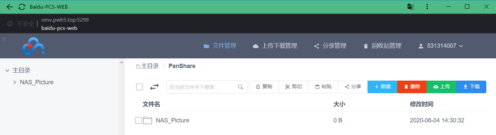

# 1. User Docs 用户文档  
系统: <kbd>Pan_NAS_CB</kbd> 版本：<kbd>V1.3</kbd> 最后编辑时间：<kbd>*20/06/17*</kbd>  

# 2. Catalog 目录
<!-- TOC -->

- [1. User Docs 用户文档](#1-user-docs-用户文档)
- [2. Catalog 目录](#2-catalog-目录)
- [3. Zero Tier 虚拟局域网](#3-zero-tier-虚拟局域网)
- [4. PanHomeCloud 导航首页](#4-panhomecloud-导航首页)
- [5. Open Media Vault 网络附属存储系统](#5-open-media-vault-网络附属存储系统)
    - [5.1. SMB 网络文件共享](#51-smb-网络文件共享)
- [6. NextCloud 私有云网盘](#6-nextcloud-私有云网盘)
    - [6.1. 网页端访问](#61-网页端访问)
    - [6.2. 客户端下载安装](#62-客户端下载安装)
    - [6.3. 网盘拓展功能](#63-网盘拓展功能)
- [7. Jellyfin 家庭多媒体系统](#7-jellyfin-家庭多媒体系统)
- [8. Rsync 照片同步系统](#8-rsync-照片同步系统)
- [9. Version Log 版本日志](#9-version-log-版本日志)

<!-- /TOC -->

# 3. Zero Tier 虚拟局域网  
* [Zero Tier](https://www.zerotier.com/) 是一个虚拟局域网 (VLAN) 方案。  
* 如果**不需要**在外网（无法连接家里的路由器，如使用4G蜂窝网络）时访问家里局域网的资源，**可跳过此步骤**。
* 因为我们家使用的~~垃圾~~移动宽带网络无法申请到公网 IP，所以在外网无法直接访问家里局域网的资源。因此，想要随时随地高速访问家里的资源就要安装 Zero Tier 软件。
1. 安装及配置
    

    
<u>显示详细教程</u>（点击此处）
  
  
    * 软件安装包下载地址：[官方下载网址](https://www.zerotier.com/download/) https://www.zerotier.com/download/  
    1. Windows：  
          

        + 安装过程：略……  
            - 软件安装位置：（无限制）
        + 双击图标，运行软件
        + 配置：  
            - 右键点击系统托盘处软件图标，点击 <kbd>Join Network…</kbd>   
                  

            - 输入：`6ab565387af53c59`  
                  

            - 网络：选择 <kbd>是</kbd>  
                   

            - 可选配置：开机自启：  
                点击 <kbd>Preferences</kbd>  
                   

                勾选 <kbd>Launch ZeroTier On Startup</kbd>  
                   

    1. ios(iPhone/iPad…)：  
        + 因为~~富强、民主、文明、和谐、自由、平等、公正、法治、爱国、敬业、诚信、友善~~，  
            App Store 中国区无法下载安装 <kbd>ZeroTier One</kbd> 软件。需要自行百度：美区 Apple ID 账号分享。  
            使用美区 Apple ID 账号下载安装 <kbd>ZeroTier One</kbd> 软件。  
        + 输入 <kbd>Network ID</kbd> ：`6ab565387af53c59` ，点击 <kbd>Add Network</kbd> 。  

    

1. 网络测试  
    * 打开[Nextcloud网站链接](https://nextcloud.pan7.top:4433/)：https://nextcloud.pan7.top:4433/  
1. 下文提及**外网访问**处，均需要 启动 ZeroTier One 软件，并 Join Network 。
    * 若按照上面教程设置，平时基本无需维护。电脑开机后会 自动启动 ZeroTier One 软件并 Join Network 。

*[返回目录](#2-catalog-目录)*  

# 4. PanHomeCloud 导航首页
* 可以通过导航首页访问服务器的众多功能。  
1. 局域网访问地址：[PanHomeCloud_Local网址](http://192.168.3.3) http://192.168.3.3  
1. ZeroTier访问地址：[PanHomeCloud_ZeroTier网址](https://ztcb.pwb5.top/) https://ztcb.pwb5.top/  
1. 外网访问地址：[PanHomeCloud_AliHK网址](https://home.cloud.pan7.top/) https://home.cloud.pan7.top/  

      

*[返回目录](#2-catalog-目录)*  

# 5. Open Media Vault 网络附属存储系统  
* [Open Media Vault](https://www.openmediavault.org/) 是一个网络附属存储 (NAS) 系统。

1. 修改用户密码：
    

    
<u>显示详细教程</u>（点击此处）
  
    
    * 初始密码为 <kbd>22331820</kbd>    
        打开 [OpenMediaVault 用户管理](http://smb.pwb5.top:88) 网页，登录后按如下操作即可修改密码。  
        
          
    

## 5.1. SMB 网络文件共享  
* 服务器信息块（Server Message Block，SMB）是一个网络文件共享协议，它允许应用程序和终端用户从远端的文件服务器访问文件资源。  

      

    

    
<u>显示详细教程</u>（点击此处）
  
    
    * 局域网访问：文件夹地址栏输入：`\\NAS-CB`  
    * 外网访问：文件夹地址栏输入：`\\SMB.PWB5.TOP`
    * 输入账号密码即可使用。
    * 映射网络驱动器 到 此电脑：  

           
    * 勾选 <kbd>登录时重新连接</kbd> ，则电脑开机后，会自动重新连接SMB。

          
    
  
      

*[返回目录](#2-catalog-目录)*  

# 6. NextCloud 私有云网盘  
* [NextCloud](https://nextcloud.com/) 是一个免费专业的私有云存储网盘开源项目，可以架设一套属于自己或团队专属的云同步网盘，从而实现跨平台跨设备文件同步、共享、版本控制、团队协作等功能。  

## 6.1. 网页端访问  
<!-- 1. [NextCloud_ZeroTier网址](http://192.168.192.125:2020) -->
1. 局域网访问地址：[NextCloud_Local网址](http://192.168.3.3:2020) http://192.168.3.3:2020  
1. ZeroTier访问地址：[NextCloud_ZeroTier网址](https://nextcloud.pan7.top:4433/) https://nextcloud.pan7.top:4433/  

      

## 6.2. 客户端下载安装   
* 根据需求安装windows、ios客户端。  
    + windows客户端有 **文件夹同步** 功能，类似于OneDrive。  
    + 可以不安装客户端，只直接使用网页端。  
* [客户端_官方下载网址](https://nextcloud.com/install/#install-clients) 

       

## 6.3. 网盘拓展功能
* 

    
<u>显示详细教程</u>（点击此处）
  
        
    * 点击网页左上角，打开**功能栏**。  

          
    
    1. **下载器**  
        * 在1中输入下载地址，点击2开始下载。  

               

        * 下载完成后，文件自动保存在 <kbd>NAS_Download/Download_NextCloud/Files</kbd> 目录。   

               
    1. **Flowupload 大文件上传**

    
  

*[返回目录](#2-catalog-目录)*  

# 7. Jellyfin 家庭多媒体系统
* [Jellyfin](https://jellyfin.org/) 是一个自由的软件媒体系统，用于控制和管理媒体和流媒体。  
1. 局域网访问地址：[Jellyfin_Local网址](http://192.168.3.3:8096) http://192.168.3.3:8096  
1. ZeroTier访问地址：[Jellyfin_ZeroTier网址](http://Jellyfin.PWB5.top:8096) http://Jellyfin.PWB5.top:8096  

      

1. 添加资源到媒体库。
    * **电影**
        + 导入已下载的电影：  
            - 通过 NextCloud 网盘的 Flowupload 上传至 /NAS_Movies 文件夹。  
                

                
<u>显示详细教程</u>（点击此处）
  
                
                    
                    
                

            - 通过 SMB 上传至 /NAS_Movies 文件夹。  
        + 从网上下载电影：  
            (待完善……)
            <!-- 使用 [Transmission 下载器](http://ztcb.pwb5.top:9091) 下载电影链接；  
            登录账号：<kbd>admin</kbd>密码：<kbd>admin</kbd>。 -->
            <!-- 使用 [Deluge 下载器](http://Jellyfin.PWB5.top:8112) 下载电影链接。登录密码：<kbd>8899</kbd>。 -->
    * **电视剧**
        + 同上，文件夹为 /NAS_TVShows
    * **音乐**

*[返回目录](#2-catalog-目录)*  

# 8. Rsync 照片同步系统
* 待完善……
<!-- 1.  -->

*[返回目录](#2-catalog-目录)*  

<!-- # 6. BaiduPCS  百度网盘网页版
* [baidupcs-web](https://github.com/liuzhuoling2011/baidupcs-web)是一个百度网盘网页版软件。  
1. 局域网访问地址：[BaiduPCS_Local网址](http://192.168.3.66:5299) http://192.168.3.66:5299  
1. 外网访问地址：[BaiduPCS_DNS网址](http://OMV.PWB5.top:5299) http://OMV.PWB5.top:5299  

    

1. 登录：
    + 注意：目前使用账号密码登录可能失败，目前无法通过分享链接下载。

*[返回目录](#2-catalog-目录)*   -->

# 9. Version Log 版本日志  
1. V1.0 20/06/03  
    * 新增功能：  
        + [Zero Tier 虚拟局域网](#3-zero-tier-虚拟局域网) ;  
        + [Open Media Vault 网络附属存储系统](#5-open-media-vault-网络附属存储系统) ;  
        + [NextCloud 私有云网盘](#6-nextcloud-私有云网盘) ;  
        + [Jellyfin 家庭多媒体系统](#7-jellyfin-家庭多媒体系统) ;  
1. V1.1 20/06/10  
    * 新增功能：  
        + [Rsync 照片同步系统](#7-rsync-照片同步系统)  
1. V1.2 20/06/15  
    * 服务器硬件升级迁移：  
        + 使用 Chainedbox 硬件与 Armbian_Mix_With_Navi_1213 固件搭建服务器。  
    * 新增功能：  
        + [PanHomeCloud 导航首页](#4-panhomecloud-导航首页)  
1. V1.3 20/06/17
    * 新增功能：
        + 启用SSL证书，https安全访问网站。

*[返回目录](#2-catalog-目录)*  
